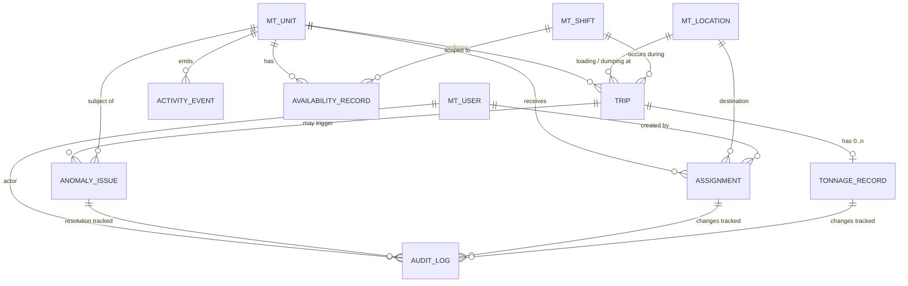
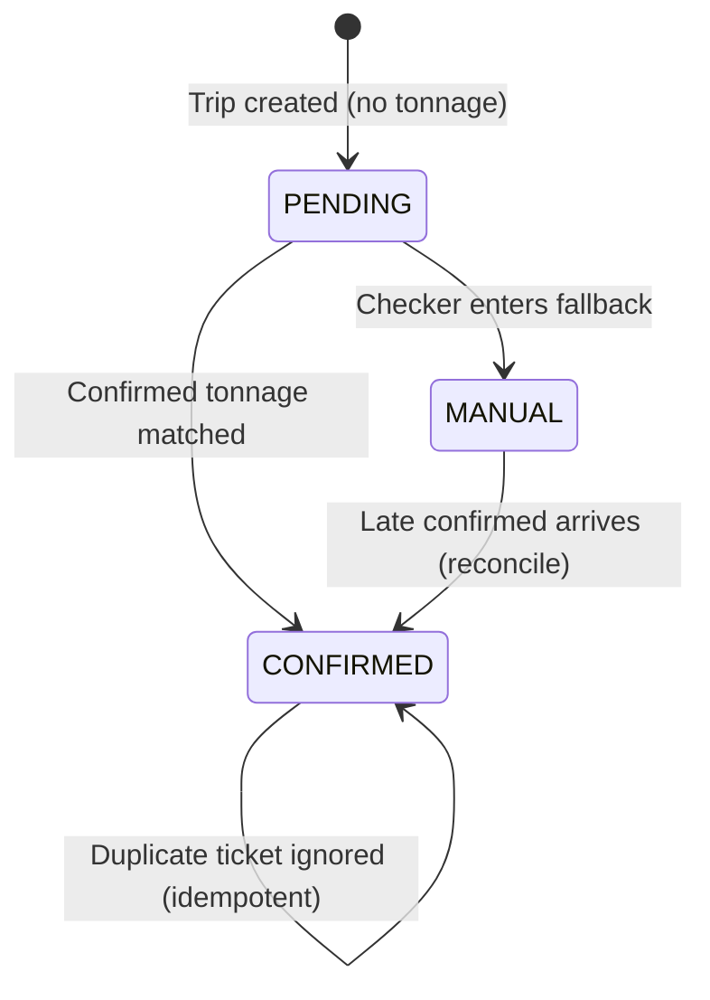

# Data Model & Schema — PTBA CHT Web Portal POC

> Source of truth: `/docs/01_PRD_Web_Portal.md`, `/docs/02_Metrics_Definitions.md`, `/docs/04_Master_Data_Template.md`, `/docs/05_Integration_Mapping_PTBA.md`, `/docs/06_UAT_Test_Scenarios.md`

---

## 1 · Conceptual Model



### Entity summary

| Entity | Purpose |
|---|---|
| `mt_unit` | Fleet master — trucks, loaders, support equipment |
| `mt_location` | Loading & dumping points (stockpile, jetty, hopper, etc.) |
| `mt_shift` | Shift definitions for time-windowed aggregation |
| `mt_user` / `mt_role` | Portal users and RBAC |
| `mt_delay_category` | Standardized delay labels (optional POC) |
| `mt_breakdown_category` | Standardized breakdown labels (optional POC) |
| `trip` | One hauling cycle (load → travel → dump) |
| `tonnage_record` | Tonnage entries linked to a trip (CONFIRMED / MANUAL) |
| `assignment` | Dispatch assignment: unit → destination |
| `activity_event` | Timestamped activity log per unit |
| `availability_record` | Time-bucket summary per unit per shift |
| `anomaly_issue` | Data quality flag (rule-based) |
| `audit_log` | Immutable record of all manual edits & corrections |

---

## 2 · Logical Tables

### 2.1 Master Data

#### `mt_unit`

| Field | Type | Req? | Description | Example | Source |
|---|---|:---:|---|---|---|
| `unit_id` | string (PK) | ✅ | Unique unit identifier | `DT-043` | Manual / import |
| `unit_name` | string | ✅ | Display name | `DT 043` | Manual |
| `unit_type` | enum | ✅ | `DUMP_TRUCK` · `LOADER` · `SUPPORT` | `DUMP_TRUCK` | Manual |
| `ownership` | enum | ✅ | `OWN` · `RENTAL` | `RENTAL` | Manual |
| `vendor_name` | string | ❌ | Vendor (for rentals) | `ABC Rental` | Manual |
| `capacity_ton` | decimal | ❌ | Nominal capacity; used by `TONNAGE_OUTLIER` rule | `35` | Manual |
| `is_active` | boolean | ✅ | Active in fleet board | `true` | Manual |
| `notes` | text | ❌ | Free text | — | Manual |
| `created_at` | timestamp | ✅ | Record creation time | — | System |
| `updated_at` | timestamp | ✅ | Last modification time | — | System |

**Keys:** PK `unit_id`. Index on `is_active`, `unit_type`.

---

#### `mt_location`

| Field | Type | Req? | Description | Example | Source |
|---|---|:---:|---|---|---|
| `location_id` | string (PK) | ✅ | Unique location ID | `DUMP-JTY-01` | Manual |
| `location_name` | string | ✅ | Display name | `Jetty Stockpile 1` | Manual |
| `location_role` | enum | ✅ | `LOADING` · `DUMPING` · `OTHER` | `DUMPING` | Manual |
| `is_active` | boolean | ✅ | Available in dropdowns | `true` | Manual |
| `sort_order` | integer | ❌ | Display ordering | `10` | Manual |
| `notes` | text | ❌ | — | — | Manual |
| `latitude` | decimal | ❌ | **Optional** — not required for POC | `-3.75` | Manual |
| `longitude` | decimal | ❌ | **Optional** — not required for POC | `103.80` | Manual |
| `created_at` | timestamp | ✅ | — | — | System |
| `updated_at` | timestamp | ✅ | — | — | System |

**Keys:** PK `location_id`. Index on `location_role`, `is_active`.

> `latitude` / `longitude` are explicitly optional. Map tracking is NOT a POC requirement.

---

#### `mt_shift`

| Field | Type | Req? | Description | Example | Source |
|---|---|:---:|---|---|---|
| `shift_id` | string (PK) | ✅ | Unique shift ID | `SHIFT-A` | Manual |
| `shift_name` | string | ✅ | Display name | `Shift A` | Manual |
| `start_time` | time | ✅ | Shift start (local) | `07:00` | Manual |
| `end_time` | time | ✅ | Shift end (local) | `19:00` | Manual |
| `timezone` | string | ✅ | IANA timezone | `Asia/Jakarta` | Manual |
| `is_active` | boolean | ✅ | — | `true` | Manual |

**Keys:** PK `shift_id`.

---

#### `mt_user`

| Field | Type | Req? | Description | Example | Source |
|---|---|:---:|---|---|---|
| `user_id` | string (PK) | ✅ | Unique user ID | `u-102` | Manual |
| `full_name` | string | ✅ | Display name | `Nanda` | Manual |
| `role` | enum | ✅ | `ADMIN` · `DISPATCHER` · `CHECKER` · `SUPERVISOR` | `DISPATCHER` | Manual |
| `is_active` | boolean | ✅ | Can log in | `true` | Manual |
| `created_at` | timestamp | ✅ | — | — | System |

**Keys:** PK `user_id`. Index on `role`, `is_active`.

---

#### `mt_delay_category` (Optional POC)

| Field | Type | Req? | Description | Example | Source |
|---|---|:---:|---|---|---|
| `category_id` | string (PK) | ✅ | — | `DEL-QUEUE` | Manual |
| `category_name` | string | ✅ | — | `Queue at loading` | Manual |
| `is_active` | boolean | ✅ | — | `true` | Manual |

---

#### `mt_breakdown_category` (Optional POC)

| Field | Type | Req? | Description | Example | Source |
|---|---|:---:|---|---|---|
| `category_id` | string (PK) | ✅ | — | `BD-TIRE` | Manual |
| `category_name` | string | ✅ | — | `Tire issue` | Manual |
| `is_active` | boolean | ✅ | — | `true` | Manual |

---

### 2.2 Operational Entities

#### `trip`

One hauling cycle (load → travel → dump). A trip can exist **without tonnage** (status = PENDING).

| Field | Type | Req? | Description | Example | Source |
|---|---|:---:|---|---|---|
| `trip_id` | string (PK) | ✅ | Auto-generated unique ID | `TRP-20260219-0042` | System |
| `unit_id` | string (FK) | ✅ | → `mt_unit` | `DT-043` | Event / Manual |
| `shift_id` | string (FK) | ✅ | → `mt_shift` (derived from timestamps) | `SHIFT-A` | System |
| `loading_location_id` | string (FK) | ❌ | → `mt_location` (may be unknown) | `LOAD-SP-02` | Event / Manual |
| `dumping_location_id` | string (FK) | ✅ | → `mt_location` | `DUMP-JTY-01` | Event / Manual |
| `depart_load_ts` | timestamp | ❌ | Departure from loading point | — | Event |
| `arrive_dump_ts` | timestamp | ❌ | Arrival at dump point | — | Event |
| `dump_done_ts` | timestamp | ❌ | Dumping completed | — | Event |
| `tonnage_status` | enum | ✅ | `PENDING` · `CONFIRMED` · `MANUAL` | `PENDING` | System |
| `tonnage_value` | decimal | ❌ | Active tonnage (null when PENDING) | `32.5` | Integration / Manual |
| `tonnage_source_system` | string | ❌ | Source for CONFIRMED: `PTBA_WB` · `PTBA_RFID` · `PTBA_PROD_APP` | `PTBA_WB` | Integration |
| `external_ticket_id` | string | ❌ | Ticket from PTBA system (for matching) | `WB-2026-88421` | Integration |
| `is_duplicate_flagged` | boolean | ✅ | Excluded from aggregates until resolved | `false` | System |
| `created_at` | timestamp | ✅ | — | — | System |
| `updated_at` | timestamp | ✅ | — | — | System |

**Keys:** PK `trip_id`. FK `unit_id`, `shift_id`, `loading_location_id`, `dumping_location_id`. Index on `tonnage_status`, `shift_id`, `unit_id`, `external_ticket_id`.

**Counting rule:** A trip counts toward ritase if it has at minimum `unit_id` + `dumping_location_id` + at least one timestamp (`depart_load_ts` or `dump_done_ts`). Trips with `is_duplicate_flagged = true` are excluded from aggregates until resolved (ref: `02_Metrics_Definitions.md` §1.1).

---

#### `tonnage_record`

Stores **every** tonnage entry for a trip — enables full audit of reconciliation without losing data.

| Field | Type | Req? | Description | Example | Source |
|---|---|:---:|---|---|---|
| `tonnage_record_id` | string (PK) | ✅ | Auto-generated | `TONN-0001` | System |
| `trip_id` | string (FK) | ✅ | → `trip` | `TRP-20260219-0042` | System |
| `record_type` | enum | ✅ | `CONFIRMED` · `MANUAL` | `MANUAL` | System |
| `tonnage_value` | decimal | ✅ | Net tonnage | `31.0` | Integration / Manual |
| `source_system` | string | ❌ | For CONFIRMED: `PTBA_WB` / `PTBA_RFID` / `PTBA_PROD_APP` | `PTBA_WB` | Integration |
| `external_ticket_id` | string | ❌ | For CONFIRMED: ticket reference | `WB-2026-88421` | Integration |
| `gross_tonnage` | decimal | ❌ | Optional (if provided by PTBA) | `67.0` | Integration |
| `tare_tonnage` | decimal | ❌ | Optional | `36.0` | Integration |
| `manual_reason` | text | cond. | **Required when** `record_type = MANUAL` | `Weighbridge down` | Manual |
| `entered_by` | string (FK) | cond. | **Required when** `record_type = MANUAL` → `mt_user` | `u-105` | Manual |
| `attachment_ref` | string | ❌ | Optional evidence (photo/file ref) | — | Manual |
| `is_active` | boolean | ✅ | `true` = current reporting value; `false` = historical (superseded) | `true` | System |
| `raw_payload` | text/json | ❌ | Raw inbound data for CONFIRMED (audit) | — | Integration |
| `created_at` | timestamp | ✅ | — | — | System |

**Keys:** PK `tonnage_record_id`. FK `trip_id`. Index on `trip_id`, `record_type`, `is_active`.

**Design note:** When reconciliation occurs (MANUAL superseded by CONFIRMED), the MANUAL record's `is_active` is set to `false` — it is **never deleted**. The trip's `tonnage_value` and `tonnage_status` are updated to reflect the active record.

---

#### `assignment`

| Field | Type | Req? | Description | Example | Source |
|---|---|:---:|---|---|---|
| `assignment_id` | string (PK) | ✅ | Auto-generated | `ASG-0091` | System |
| `unit_id` | string (FK) | ✅ | → `mt_unit` | `DT-001` | Manual |
| `dumping_location_id` | string (FK) | ✅ | Destination → `mt_location` | `DUMP-JTY-01` | Manual |
| `loading_location_id` | string (FK) | ❌ | Optional loading point | `LOAD-SP-02` | Manual |
| `status` | enum | ✅ | `ASSIGNED` · `IN_PROGRESS` · `COMPLETED` | `ASSIGNED` | Manual / Event |
| `notes` | text | ❌ | Free text (radio context) | `Prioritas jetty` | Manual |
| `created_by` | string (FK) | ✅ | → `mt_user` | `u-102` | System |
| `created_at` | timestamp | ✅ | — | — | System |
| `updated_at` | timestamp | ✅ | — | — | System |

**Keys:** PK `assignment_id`. FK `unit_id`, `dumping_location_id`, `loading_location_id`, `created_by`. Index on `unit_id`, `status`.

> No optimization entities (queue, routing, scoring) exist. This table is strictly assignment tracking.

---

#### `activity_event`

Timestamped activity log per unit — the raw input for availability calculations and fleet board updates.

| Field | Type | Req? | Description | Example | Source |
|---|---|:---:|---|---|---|
| `event_id` | string (PK) | ✅ | Auto-generated | `EVT-00421` | System |
| `unit_id` | string (FK) | ✅ | → `mt_unit` | `DT-043` | Event / Manual |
| `event_type` | enum | ✅ | `P2H` · `LOADING` · `HAULING` · `DUMPING` · `STANDBY` · `DELAY` · `BREAKDOWN` · `IDLE` · `OTHER` | `LOADING` | Event / Manual |
| `shift_id` | string (FK) | ✅ | → `mt_shift` (derived) | `SHIFT-A` | System |
| `start_ts` | timestamp | ✅ | Event start | — | Event / Manual |
| `end_ts` | timestamp | ❌ | Event end (null = ongoing) | — | Event / Manual |
| `location_id` | string (FK) | ❌ | Optional → `mt_location` | `LOAD-SP-02` | Event |
| `delay_category_id` | string (FK) | ❌ | → `mt_delay_category` (when type = DELAY) | `DEL-QUEUE` | Manual |
| `breakdown_category_id` | string (FK) | ❌ | → `mt_breakdown_category` (when type = BREAKDOWN) | `BD-TIRE` | Manual |
| `source` | enum | ✅ | `DEVICE` · `CCR_INPUT` · `CHECKER_INPUT` · `SYSTEM` | `CCR_INPUT` | System |
| `notes` | text | ❌ | — | — | Manual |
| `latitude` | decimal | ❌ | **Optional** — not required | — | Device |
| `longitude` | decimal | ❌ | **Optional** — not required | — | Device |
| `created_at` | timestamp | ✅ | — | — | System |

**Keys:** PK `event_id`. FK `unit_id`, `shift_id`. Index on `unit_id + shift_id`, `event_type`, `start_ts`.

> `latitude` / `longitude` are optional. No geofence logic or map rendering is required.

---

#### `availability_record`

Pre-aggregated time-bucket summary per unit per shift. Derived from `activity_event` timeline.

| Field | Type | Req? | Description | Example | Source |
|---|---|:---:|---|---|---|
| `avail_id` | string (PK) | ✅ | Auto-generated | `AVL-0012` | System |
| `unit_id` | string (FK) | ✅ | → `mt_unit` | `DT-043` | System |
| `shift_id` | string (FK) | ✅ | → `mt_shift` | `SHIFT-A` | System |
| `date` | date | ✅ | Calendar date | `2026-02-19` | System |
| `scheduled_min` | integer | ✅ | `shift_end − shift_start` in minutes | `720` | System |
| `running_min` | integer | ✅ | Productive / engine-on minutes | `480` | System / Manual |
| `loading_min` | integer | ❌ | — | `90` | System / Manual |
| `hauling_min` | integer | ❌ | — | `240` | System / Manual |
| `dumping_min` | integer | ❌ | — | `60` | System / Manual |
| `standby_min` | integer | ✅ | — | `60` | System / Manual |
| `delay_min` | integer | ✅ | — | `30` | System / Manual |
| `breakdown_min` | integer | ✅ | — | `40` | System / Manual |
| `idle_min` | integer | ❌ | Optional bucket | `0` | System / Manual |
| `pa_pct` | decimal | ✅ | `(scheduled − breakdown) / scheduled` | `94.4` | System |
| `ua_pct` | decimal | ✅ | `productive / (scheduled − breakdown)` | `70.6` | System |
| `completeness_pct` | decimal | ✅ | `time_covered / scheduled` | `92.0` | System |
| `is_manual_adjusted` | boolean | ✅ | `true` if any bucket was manually edited | `false` | System |
| `created_at` | timestamp | ✅ | — | — | System |
| `updated_at` | timestamp | ✅ | — | — | System |

**Keys:** PK `avail_id`. Unique constraint `(unit_id, shift_id, date)`. Index on `date`, `unit_id`.

**Formulas** (ref: `02_Metrics_Definitions.md`):
- **PA** = `(scheduled_min − breakdown_min) / scheduled_min`
- **UA** = `running_min / (scheduled_min − breakdown_min)` (where `running_min` may equal `loading + hauling + dumping` depending on data availability)
- **Completeness** = `(sum of all non-null buckets) / scheduled_min`

**Completeness badge thresholds:**

| Range | Label | Visual |
|---|---|---|
| ≥ 90% | High confidence | Green |
| 60–89% | Medium confidence | Yellow |
| < 60% | Low confidence | Red |

---

### 2.3 Quality & Audit Entities

#### `anomaly_issue`

| Field | Type | Req? | Description | Example | Source |
|---|---|:---:|---|---|---|
| `issue_id` | string (PK) | ✅ | Auto-generated | `ISS-0034` | System |
| `issue_type` | enum | ✅ | See §5 Anomaly Rules | `TONNAGE_OUTLIER` | System |
| `severity` | enum | ✅ | `LOW` · `MEDIUM` · `HIGH` | `HIGH` | System |
| `status` | enum | ✅ | `OPEN` · `IN_REVIEW` · `RESOLVED` | `OPEN` | System / Manual |
| `unit_id` | string (FK) | ❌ | Related unit | `DT-043` | System |
| `trip_id` | string (FK) | ❌ | Related trip | `TRP-20260219-0042` | System |
| `external_ticket_id` | string | ❌ | Related ticket (for tonnage issues) | `WB-2026-88421` | System |
| `rule_threshold` | string | ❌ | Threshold that triggered the rule | `capacity ±20%` | System |
| `detail_context` | text/json | ❌ | Additional context (values, comparisons) | — | System |
| `resolved_by` | string (FK) | ❌ | → `mt_user` (when resolved) | `u-102` | Manual |
| `resolved_at` | timestamp | ❌ | — | — | System |
| `resolution_note` | text | ❌ | Mandatory when resolving | `Verified with checker` | Manual |
| `created_at` | timestamp | ✅ | — | — | System |
| `updated_at` | timestamp | ✅ | — | — | System |

**Keys:** PK `issue_id`. Index on `issue_type`, `status`, `unit_id`, `created_at`.

---

#### `audit_log`

Immutable, append-only log. Records are **never updated or deleted**.

| Field | Type | Req? | Description | Example | Source |
|---|---|:---:|---|---|---|
| `log_id` | string (PK) | ✅ | Auto-generated (sortable / ULID) | `AUD-20260219-0001` | System |
| `action` | enum | ✅ | See §4 Audit Actions enum | `MANUAL_TONNAGE_ENTERED` | System |
| `entity_type` | enum | ✅ | `TRIP` · `ASSIGNMENT` · `TONNAGE_RECORD` · `ANOMALY_ISSUE` · `MT_UNIT` · `MT_LOCATION` · `MT_SHIFT` · `MT_USER` | `TRIP` | System |
| `entity_id` | string | ✅ | ID of affected record | `TRP-20260219-0042` | System |
| `actor_user_id` | string (FK) | ✅ | → `mt_user` (who performed the action) | `u-105` | System |
| `timestamp` | timestamp | ✅ | When the action occurred | — | System |
| `before_value` | text/json | ❌ | Snapshot before change (null for create actions) | `{"tonnage_status":"PENDING"}` | System |
| `after_value` | text/json | ✅ | Snapshot after change | `{"tonnage_status":"MANUAL","tonnage_value":31}` | System |
| `reason` | text | cond. | **Required for**: manual tonnage, corrections, issue resolution. Optional for creates. | `Weighbridge down` | Manual |
| `metadata` | text/json | ❌ | Extra context (IP, session, source_ref) | — | System |

**Keys:** PK `log_id`. Index on `entity_type + entity_id`, `actor_user_id`, `timestamp`, `action`.

---

## 3 · Keys & Indexes (Conceptual Summary)

| Table | Primary Key | Unique Constraints | Key Indexes |
|---|---|---|---|
| `mt_unit` | `unit_id` | — | `is_active`, `unit_type` |
| `mt_location` | `location_id` | — | `location_role`, `is_active` |
| `mt_shift` | `shift_id` | — | `is_active` |
| `mt_user` | `user_id` | — | `role`, `is_active` |
| `trip` | `trip_id` | — | `tonnage_status`, `shift_id`, `unit_id`, `external_ticket_id` |
| `tonnage_record` | `tonnage_record_id` | — | `trip_id`, `record_type`, `is_active` |
| `assignment` | `assignment_id` | — | `unit_id`, `status` |
| `activity_event` | `event_id` | — | `(unit_id, shift_id)`, `event_type`, `start_ts` |
| `availability_record` | `avail_id` | `(unit_id, shift_id, date)` | `date`, `unit_id` |
| `anomaly_issue` | `issue_id` | — | `issue_type`, `status`, `unit_id`, `created_at` |
| `audit_log` | `log_id` | — | `(entity_type, entity_id)`, `actor_user_id`, `timestamp` |

---

## 4 · Tonnage Status Enum & State Transitions

### 4.1 Enum values

| Status | Meaning | Source |
|---|---|---|
| `PENDING` | Trip exists; confirmed tonnage has not arrived from PTBA | System (default on trip creation) |
| `CONFIRMED` | Tonnage received from PTBA system (weighbridge / RFID / production app) | Integration |
| `MANUAL` | Tonnage entered by checker as fallback (e.g., weighbridge breakdown) | Manual input |

### 4.2 State transition rules



| Transition | Trigger | Behaviour |
|---|---|---|
| `→ PENDING` | Trip created without tonnage | `tonnage_value = null` |
| `PENDING → CONFIRMED` | Inbound confirmed tonnage matched to trip | `tonnage_value` set; `tonnage_record` created with `record_type = CONFIRMED` |
| `PENDING → MANUAL` | Checker submits manual tonnage | `tonnage_value` set; `tonnage_record` created with `record_type = MANUAL`, `manual_reason` required |
| `MANUAL → CONFIRMED` | Late confirmed tonnage arrives for a MANUAL trip | Active `tonnage_record` switches to CONFIRMED; MANUAL record set `is_active = false` (preserved for audit) |
| `CONFIRMED → CONFIRMED` | Same `external_ticket_id` ingested again | Idempotent — no change, no new record |

### 4.3 Reconciliation detail (MANUAL → CONFIRMED)

1. New `tonnage_record` created with `record_type = CONFIRMED`, `is_active = true`.
2. Existing MANUAL record updated: `is_active = false` (never deleted).
3. `trip.tonnage_status` updated to `CONFIRMED`; `trip.tonnage_value` set to confirmed value.
4. `audit_log` entry created: action = `TONNAGE_RECONCILED`.
5. Optional anomaly flag `MANUAL_OVERRIDDEN_BY_CONFIRMED` (severity LOW) (Assumption (POC)).

### 4.4 Reporting roll-up rule

- **Aggregate tonnage** = SUM of `tonnage_value` where `tonnage_status IN (CONFIRMED, MANUAL)`.
- **PENDING trips** contribute to ritase count but **not** to tonnage total (value is null).
- **Tonnage coverage** = `trips_with_tonnage / total_trips` (display as "X of Y trips have tonnage").

---

## 5 · Data Quality / Anomaly Rules Model

### 5.1 Issue types

| `issue_type` | Trigger condition | Default severity | Related entity |
|---|---|---|---|
| `STALE_UPDATE` | `now − unit.last_update_ts > STALE_THRESHOLD_MIN` (default 15 min) | MEDIUM | `mt_unit` |
| `TONNAGE_PENDING_TOO_LONG` | Trip PENDING > `PENDING_THRESHOLD_HOURS` (default 4 h — Assumption (POC)) | HIGH | `trip` |
| `TONNAGE_OUTLIER` | Tonnage outside `capacity_ton × [0.10, 1.20]` (Assumption (POC)) | HIGH | `trip`, `tonnage_record` |
| `TRIP_DUPLICATE_SUSPECTED` | Two trips for same unit overlap timestamps within window | HIGH | `trip` (both) |
| `TONNAGE_MULTI_MATCH` | One confirmed ticket matches > 1 trip | HIGH | `trip`, `tonnage_record` |
| `TONNAGE_DUPLICATE_TICKET` | Same `external_ticket_id` ingested > 1 time | MEDIUM | `tonnage_record` |
| `AVAILABILITY_LOW_COMPLETENESS` | `completeness_pct < 60%` | MEDIUM | `availability_record` |
| `MANUAL_OVERRIDDEN_BY_CONFIRMED` | MANUAL tonnage superseded by late CONFIRMED | LOW | `trip`, `tonnage_record` |

### 5.2 Issue status workflow

```
OPEN → IN_REVIEW → RESOLVED
```

- **OPEN:** auto-created by system rule.
- **IN_REVIEW:** manually set by Dispatcher / Supervisor investigating.
- **RESOLVED:** closed with mandatory `resolution_note`.

### 5.3 Configuration parameters

| Parameter | Default (POC) | Used by |
|---|---|---|
| `STALE_THRESHOLD_MIN` | 15 min | `STALE_UPDATE` |
| `PENDING_THRESHOLD_HOURS` | 4 hours | `TONNAGE_PENDING_TOO_LONG` |
| `OUTLIER_LOW_FACTOR` | 0.10 | `TONNAGE_OUTLIER` |
| `OUTLIER_HIGH_FACTOR` | 1.20 | `TONNAGE_OUTLIER` |
| `DUPLICATE_WINDOW_MIN` | 10 min | `TRIP_DUPLICATE_SUSPECTED` |
| `COMPLETENESS_LOW_PCT` | 60 | `AVAILABILITY_LOW_COMPLETENESS` |
| `MATCHING_TIME_WINDOW_MIN` | 60 min | Tonnage matching (§4.2) |

> All thresholds are configurable. Defaults above are Assumption (POC); align with PTBA during kickoff.

---

## 6 · Audit Trail Design

### 6.1 Principles

1. **Append-only.** `audit_log` records are never updated or deleted.
2. **Complete.** Every manual edit, correction, status change, and reconciliation event creates a record.
3. **Traceable.** Each record answers: **who** (`actor_user_id`), **what** (`action`, `entity_type`, `entity_id`, `before_value`, `after_value`), **when** (`timestamp`), **why** (`reason`).
4. **Non-blocking.** Audit writes must not block the user action; they can be asynchronous but must be durable.

### 6.2 Audited actions

| `action` enum | Trigger | `reason` required? |
|---|---|:---:|
| `MANUAL_TONNAGE_ENTERED` | Checker submits manual tonnage | ✅ |
| `TONNAGE_RECONCILED` | System reconciles MANUAL → CONFIRMED | ❌ (system-generated) |
| `ASSIGNMENT_CREATED` | Dispatcher creates assignment | ❌ |
| `ASSIGNMENT_UPDATED` | Status or notes changed | ❌ (reason optional) |
| `TRIP_CORRECTED` | Any manual correction to trip fields | ✅ |
| `ISSUE_STATUS_CHANGED` | Anomaly status transition | ✅ (on resolve) |
| `MASTER_DATA_CHANGED` | Admin edits unit / location / shift / user | ❌ (P1 — recommended) |

### 6.3 Before / after storage

- `before_value` and `after_value` store JSON snapshots of **changed fields only** (not the entire record).
- Example for a manual tonnage entry:

```
before_value: { "tonnage_status": "PENDING", "tonnage_value": null }
after_value:  { "tonnage_status": "MANUAL",  "tonnage_value": 31.0 }
reason:       "Weighbridge down since 06:45"
```

### 6.4 Retention

- POC default: retain all audit records (no TTL).
- Export available via CSV (see `01_Backlog_UserStories_P0P1.md` — US-P0-027).

---

## 7 · Entity Relationship Summary (Quick Reference)

| From | Relationship | To |
|---|---|---|
| `mt_unit` | 1 → N | `trip` |
| `mt_unit` | 1 → N | `assignment` |
| `mt_unit` | 1 → N | `activity_event` |
| `mt_unit` | 1 → N | `availability_record` |
| `mt_location` | 1 → N | `trip` (loading / dumping) |
| `mt_location` | 1 → N | `assignment` (destination / loading) |
| `mt_shift` | 1 → N | `trip`, `activity_event`, `availability_record` |
| `mt_user` | 1 → N | `assignment` (created_by) |
| `mt_user` | 1 → N | `audit_log` (actor) |
| `mt_user` | 1 → N | `tonnage_record` (entered_by, for MANUAL) |
| `trip` | 1 → N | `tonnage_record` |
| `trip` | 1 → N | `anomaly_issue` |
| `anomaly_issue` | 1 → N | `audit_log` |
| `assignment` | 1 → N | `audit_log` |
| `tonnage_record` | 1 → N | `audit_log` |

---

*Document generated: 2026-02-19 · Aligned with `/docs` v1 · No mandatory map coordinates · No dispatch optimization entities*
